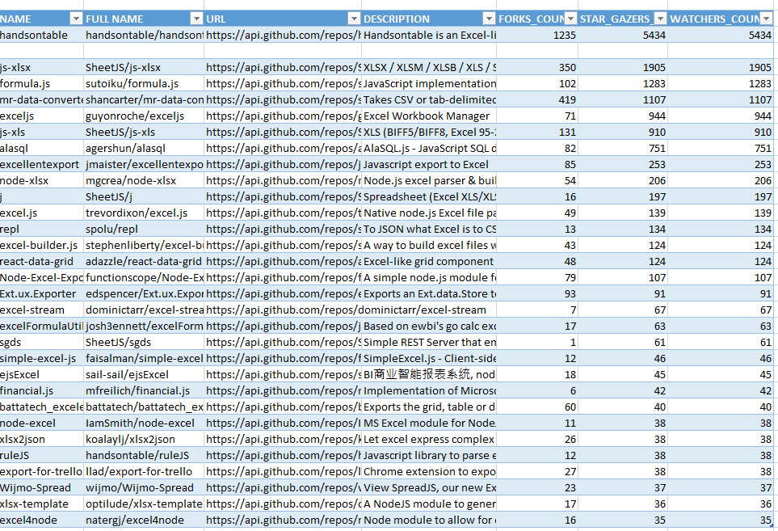
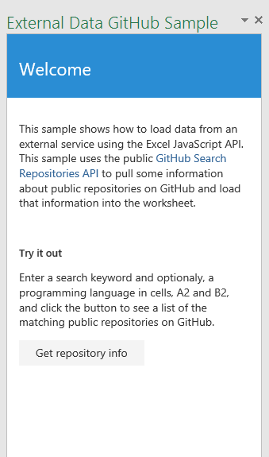

# Ejemplo del complemento del panel de tareas de datos externos de GitHub para Excel 2016

_Se aplica a: Excel 2016_

Este complemento del panel de tareas muestra cómo cargar datos de un servicio externo, por ejemplo al usar las API de búsqueda de GitHub de Excel 2016. Hay dos tipos: editor de código y Visual Studio.

## Pruébelo
### Versión del editor de código

La forma más sencilla de implementar y probar el complemento consiste en copiar los archivos en un recurso compartido de red.

| Datos generales |
|---|---|
| Nombre del procedimiento | Unión de tubos de acero al carbono con costura de ranura en V sencilla |
| Proceso de soldadura | SMAW |
| Material base | Tubos de acero al carbono ASTM A53 Grado B |
| Espesor del material base | 10 mm |
| Posición de soldadura | Horizontal (1G) |
| Talla del bisel | 60° |
| Tipo de ranura | V sencilla |

| Parámetros de soldadura |
|---|---|
| Electrodo | E7018 |
| Corriente | 120 A |
| Voltaje | 20 V |
| Velocidad de avance | 20 cm/min |
| Avance de soldadura | 10 cm |
| Temperatura de precalentamiento | 100 °C |
| Temperatura de postcalentamiento | 50 °C |

| Requisitos de inspección |
|---|---|
| Visual | Prueba de aceptación visual (VT) |
| Radiografía | Prueba de radiografía (RT) |
| Ultrasonido | Prueba de ultrasonido (UT) |

| Observaciones |
|---|---|
| El WPS debe ser revisado y aprobado por un ingeniero calificado. |
| El soldador debe estar calificado para el procedimiento de soldadura especificado. |
| El material de aporte debe cumplir con los requisitos del código o norma aplicables. |

### Versión de Visual Studio
1.  Copie el proyecto en una carpeta local y abra Excel-Add-in-JS-ExternalDataGitHub.sln en Visual Studio.
2.  Pulse F5 para crear e implementar el complemento de ejemplo. Excel se inicia y se abre el complemento en un panel de tareas a la derecha de una hoja de cálculo en blanco, como se muestra en la siguiente ilustración.

  

3.  Escriba una palabra clave de búsqueda y un lenguaje de programación en las celdas A2 y B2 y haga clic en el botón Obtener información del repositorio para cargar los resultados en la tabla de la hoja de cálculo, tal como se muestra a continuación.

  

